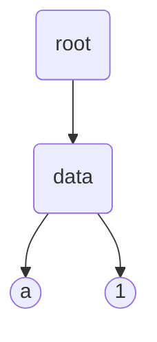
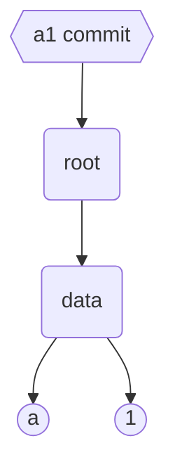
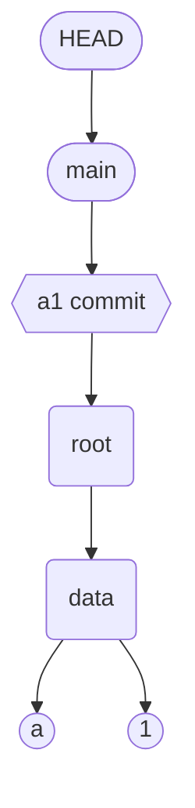

本文介绍了 git 的工作原理。

### 创建项目

```shell
mkdir alpha
cd alpha
```

创建 alpha 目录作为工作目录

```shell
mkdir data
printf 'a' > data/letter.txt
```

在 alpha 目录下创建 data 目录，在 data 目录下新建 letter.txt 文件，文件内容是 a

目前 alpha 的目录结构如下：

```shell
alpha
  data
    letter.txt
```

### 初始化 git

在 alpha 目录下运行 `git init` 命令。这个命令会将当前目录变为一个 git 仓库。当前目录下的 .git 目录存放着 git 相关的文件。

.git 目录下的文件属于 git，其余的文件为用户所有。

### git add

```shell
git add data/letter.txt
```

运行 git add 命令，将 data/letter.txt 文件添加到 git 中。

运行 add 命令后，会产生两个变化。

首先，在 .git/objects/ 目录下会新建一个 blob 文件，文件中包含 data/letter.txt 文件中压缩后的内容。文件名称来源于文件内容的 hash。

文件内容 a 的 hash 结果是 2e65efe2a145dda7ee51d1741299f848e5bf752e，其中 2e 作为文件目录，剩余部分作为文件名称，因此新的文件路径为 `.git/objects/2e/65efe2a145dda7ee51d1741299f848e5bf752e`

我们也可以使用 cat-file 命令查看文件的内容。

```shell
git cat-file -p 2e65efe2a145dda7ee51d1741299f848e5bf752e
```

然后，git 还会新建一个 index 文件，文件内容包含所追踪的文件路径和文件内容 hash。index 文件内容的每一行都代表一个文件名和文件内容 hash 的映射。

运行以下命令可以查看当前 index 文件中的内容。

```shell
git ls-files --stage

# 100644 2e65efe2a145dda7ee51d1741299f848e5bf752e 0	data/letter.txt
```

接下来新建一个文件，然后运行 git add 命令

```shell
printf '1234' > data/number.txt

git add data
```

增加一个新的文件后，.git 会新增一个 object 和一条新的 index 记录（使用 git ls-files --stage 命令查看 index 的内容）

```shell
git ls-files --stage

# 100644 2e65efe2a145dda7ee51d1741299f848e5bf752e 0	data/letter.txt
# 100644 274c0052dd5408f8ae2bc8440029ff67d79bc5c3 0	data/number.txt
```

现在对 data/number.txt 内容做修改，并添加到 git 中

```shell
printf '1' > data/number.txt

git add data
```

.git/objects 目录下会生成一条新的记录，但是 index 会更新成最新的文件内容 hash

```shell
git ls-files --stage

# 100644 2e65efe2a145dda7ee51d1741299f848e5bf752e 0	data/letter.txt
# 100644 56a6051ca2b02b04ef92d5150c9ef600403cb1de 0	data/number.txt
```

每次文件内容有改动，运行 git add 命令后，就会生成最新的 object，index 会引用最新的 object

### git commit

```shell
git commit -m 'a1'
```

运行 commit 命令后，git 会做一下三件事
1. 创建 tree graph
2. 创建一个 commit
3. 将当前分支指向最新的 commit

运行 git commit 命令后，objects 中生成了三个 object, 这三个 object 对应上面的三个步骤


#### 创建 tree graph

git 通过 index 创建 tree graph 来记录项目当前的状态。graph 由 blobs 和 trees 组成。blobs 在运行 git add 是存储，代表文件的内容。tree 在运行 git commit 时生成，一棵树代表工作目录的一次备份。

下面是记录 `data` 目录的 tree object

```shell
git cat-file -p 0eed1217a2947f4930583229987d90fe5e8e0b74
# 100644 blob 2e65efe2a145dda7ee51d1741299f848e5bf752e	letter.txt
# 100644 blob 56a6051ca2b02b04ef92d5150c9ef600403cb1de	number.txt
```

每一条记录从左到右分别为 权限，类型，内容的 hash 和文件名称。

下面是记录 `alpha` 目录的 tree object

```shell
git cat-file -p ffe298c3ce8bb07326f888907996eaa48d266db4
# 040000 tree 0eed1217a2947f4930583229987d90fe5e8e0b74	data
```

从左到右依次是 权限，类型，hash 和 目录/文件名称。当前 hash 指向的是 `data` 目录的 tree object。当前的目录关系如下：



root 指向 data 目录，data 目录中有两个文件 letter.txt 和 number.txt，其内容分别为 a 和 1

#### 创建一个 commit object

`git commit` 创建一个 commit 对象，

```shell
git cat-file -p 9375dd0a22ac299690d500607d5b4b0a108f8ba0
# tree ffe298c3ce8bb07326f888907996eaa48d266db4
# author name <emaill@xx.com> 1665136447 +0800
# committer name <emaill@xx.com> 1665136447 +0800

# a1
```

查看该 commit 内容，第一行指向了 root 的 tree,第二，三行为提交人的相关信息，最后面是 commit 的注释信息。因此，目前的 tree graph 如下



#### 将当前分支指向新的 commit

当前分支是什么？ .git/HEAD 文件中存放着当前分支名称

```shell
cat .git/HEAD
# ref: refs/heads/main
```

HEAD 指向 main 分支。接下来查看 main 分支指向什么

```shell
cat .git/refs/heads/main
# 9375dd0a22ac299690d500607d5b4b0a108f8ba0
```

main 分支指向的是新的 commit。将 HEAD 和 main 加入到 tree graph 中



### 第二次 commit

目前仓库中有三块区域，第一是用户的工作区，用户所有的改动会直接显示到这一区域；第二是 git 的 index，运行 git add 命令后会更新 index 区，最后是 commit 区，运行 git commit 后会更新 commit 的信息